# Aging

**Allometric Laws:**

Lifespan (not accurate): Exceptions: bats, naked mole rat, etc

$$
L \propto M^{1/4}
$$

Kleiber’s Law: power consumption:

$$
W\propto M^{3/4}
$$

Rate of living theory: Lifespan is inversely related to its metabolic rate. Candle that burns brightest burns fastest.

$$
\frac{L}{M}\propto M^{-1/4}\propto W^{-1/3}
$$

Heart rate:

$$
HR\propto M^{-1/4}
$$

Total heart beats in lifespan is same:

$$
T=HR\times L=M^{-1/4}M^{1/4}=c\approx 3\times 10^9
$$

**Evolutionary Theory of Trade-Offs:**

Recent data on Longevity versus mass (2D):

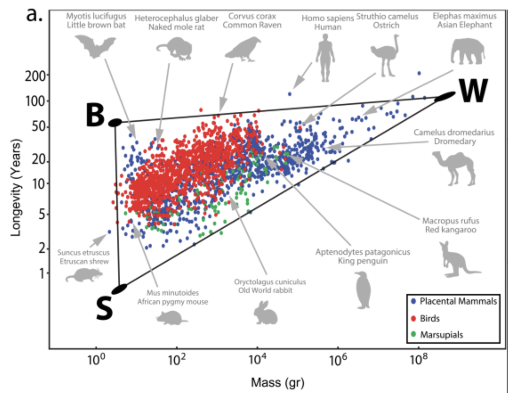

Pareto Task Inference:

3 life strategies/archetypes:

- **Live fast die young strategy (S)**: eg: shrew and mice
- **Slow life strategy (W)**: big size, low predation. eg: elephants and whales
- **Protected niche strategy (B)**: flying, being underground, cognition, living on trees allows them to face less predation. eg: bats, naked mole rate, primates, squirrels

4th possible archetype: ratio of adult/birth weight. eg: bears. bear cubs weigh: 200g but adults weigh: 300kg

Recent data on Longevity versus mass and ratio of adult/birth weight(3D):

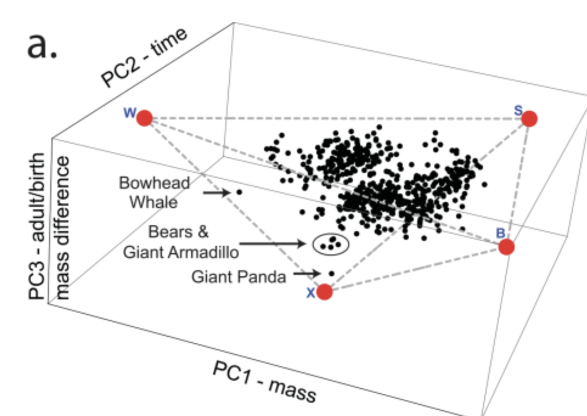

Other examples:

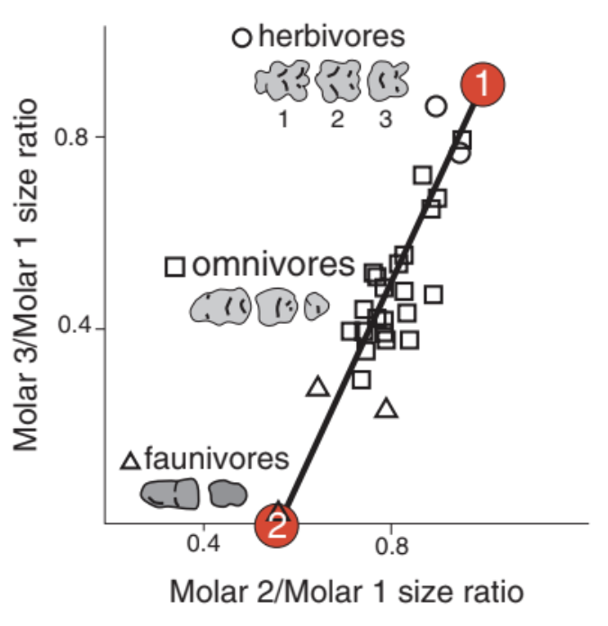

All in all, bigger species tend to live longer. But within a species, there is an opposite trend - bigger individuals are shorter lived than smaller ones

**Peto paradox:** how can very large mammals avoid cancer? The large animals have so many cells and cell divisions that cancer seems unavoidable. Reduced mutations reduce cancer. Long lived animals have other anticancer features: Elephants have duplication of p53, a major tumor suppressor gene. Naked mole rats have hyaluronic acid that enhances contact inhibition and are tuned to strong apoptosis (huge wound then healing) after toxic drug exposure on the skin that would give mice cancer. The accuracy of making proteins also rises in long lived animals compared to short lived ones.

---

---

---

“Treating the major risk factor, aging itself, rather than treating one disease at a time can be a turning point in medicine.”

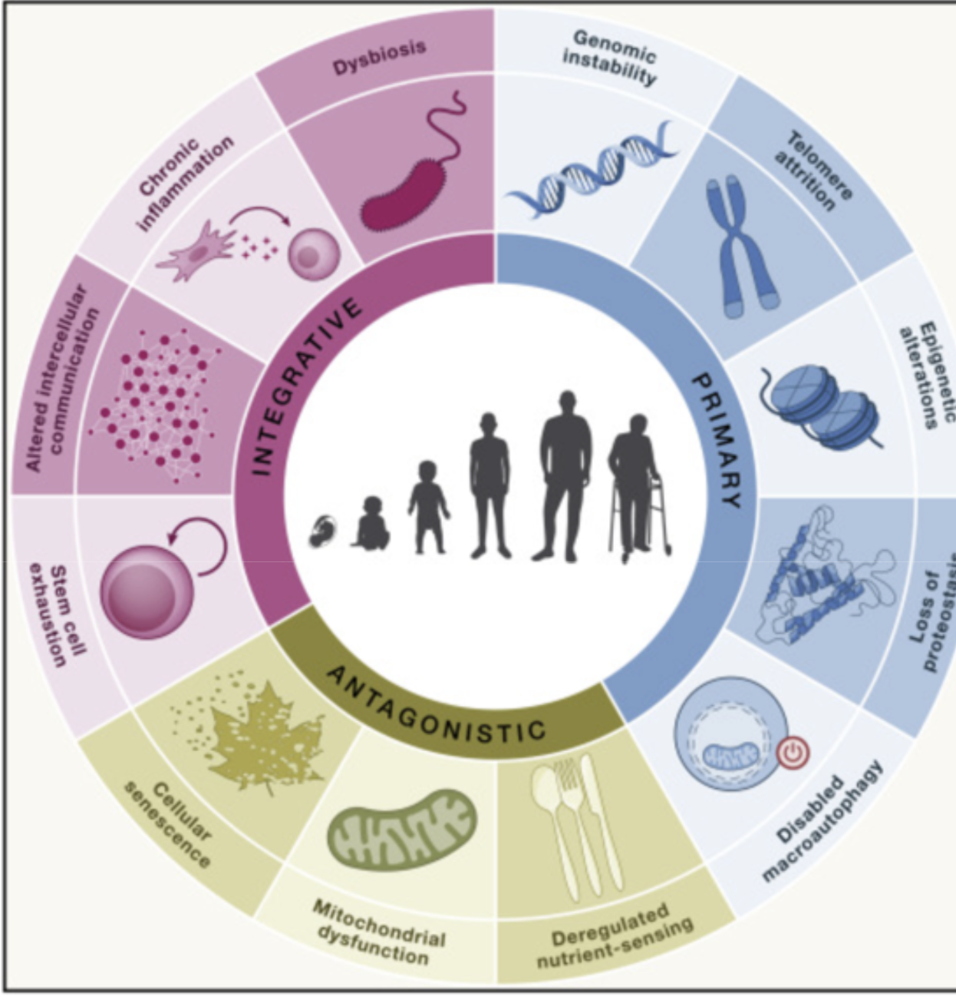

## Hallmarks of aging:

DNA Hallmarks:

1. **Genome instability:** Double strand breaks, mutations-repair can’t happen (Werner and Bloom Syndrome)
2. **Telomere attrition:** Shortening of telomere with each cell division-anti-cancer mechanism  (Hayflick limit: 60), DNA damage in telomere accumulate in non-dividing cells as they cannot be repaired because of protective covering. Stem cells telomere is replenished by enzymes.
3. **Epigenetic alteration:** Caused by histone acetylation, DNA methylation

Protein Hallmarks:

1. **Loss of proteostasis**: Protein aggregates increase with age. The repair mechanism: chaperones to refold the protein, protease to degrade them, autophagy to recycle them gets overwhelmed
2. **Deregulated nutrient sensing:** mTOR: sensor that controls growth or repair. input: nutrients. output: rate of production of protein or expression of recycling machines. Rapamycin is mTOR inhibitor, it increases recycling and extend lifespan. TOR: Target for Rapamycin. Rapamycin allows us to mimic caloric restriction. AMPK is energy sensor activated during lower nutrient availability. Metformin is AMPK activator.

Mitochondria Hallmarks:

1. **Mitochondrial dysfunction:** Oxidative stress, mtDNA mutations, decreased mitochondrial biogenesis, impaired mitophagy. Immune cells can start attacking thinking its bacteria.
2. **Disabled macroautophagy:** Degradation and replacement of damaged organelles

Cell Hallmarks:

1. **Senescent cells**
    
    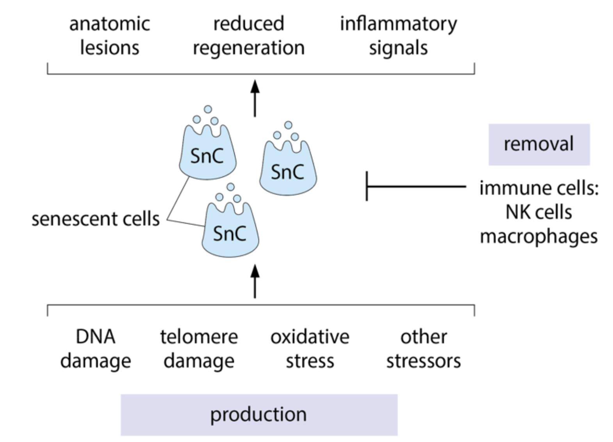
    

Organ Hallmarks:

1. **Chronic inflammation:** Caused by senescent cells
2. **Stem cell exhaustion**: Senescent cell SASP causes stem cells to divide less
3. **Altered intercellular communication:** Due to inflammation
4. **Dysbiosis**: Increased leakage of bacteria from gut into circulation

## Strategies for intrinsic immortality:

- **Regeneration**:

**Planarians and Hydra**:

1. Regenerative Capacity: Planarians have an extraordinary ability to regenerate lost body parts, including their brain, gut, and tail. This is powered by pluripotent stem cells that can differentiate into any cell type needed for regeneration.
2. Telomere Maintenance: Unlike most animals, planarians can maintain the length of their telomeres, which are protective caps at the ends of chromosomes. This prevents cellular aging and allows their cells to continue dividing indefinitely.
3. Stem Cell Activity: Planarians have a high number of active stem cells that continuously replace aged or damaged cells. This constant renewal helps them avoid the typical signs of aging seen in other organisms.
- **Return to embryonic stage**:

**Immortal Jellyfish**:

The immortal jellyfish, *Turritopsis dohrnii*, a 5mm marine animal, has a unique ability to reverse its life cycle. This process is called transdifferentiation, where the jellyfish can transform its cells from a mature form back into an earlier stage of its life cycle.

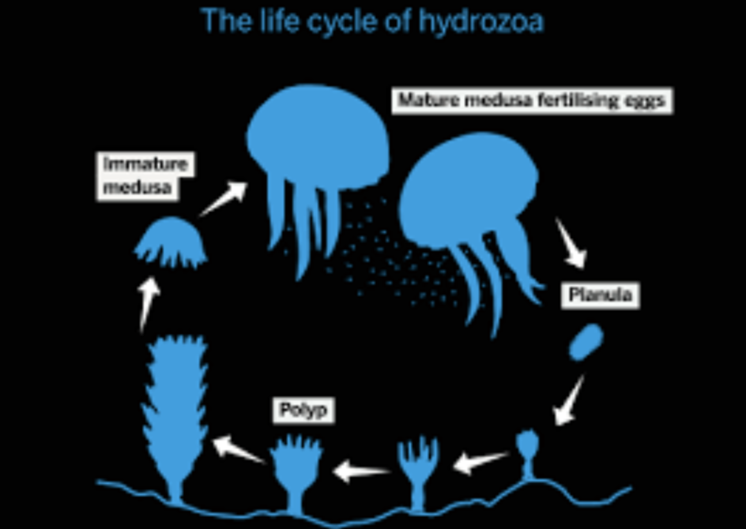

- **Compartmentalization of damaged cells:**

**Trees**:

Compartmentalization: Trees have a unique ability to compartmentalize damaged or diseased areas. They can isolate and seal off affected parts, preventing the spread of infections or decay.

- **Symmetric division:**

***E. coli:***

[Saturating Removal Model](https://www.notion.so/Saturating-Removal-Model-238d76b95ec280b992c9e8fe3d5d5777?pvs=21)

# Part 1: Compressing Morbidity

- Preventing glucose spikes
- Senolytics
- Non-feminizing estradiol

# Part 2: Extending Maximal Lifespan

## Epigenetic Reprogramming

“A forty year old egg and a forty year old sperm fuse to create a zero year old baby! Wow.”

Sperm and egg erase their aging-related changes to through a process called epigenetic
reprogramming. This ensures that the offspring start with a "clean slate" and are not burdened
with the accumulated epigenetic marks of aging from their parents.

Epigenetic changes are of 2 types:

- **DNA methylation:** In addition to the 4 base pairs, DNA comes with extra tags that serve as  signals for whether a gene should be kept on or off over the longer term. The most common of these is the addition of methyl $(-CH_3)$ group to cytosine. When C’s at the right place are methylated in this way, the genes ahead of them are kept switched off. A **methylome** is the collection of methylated cytosines in a genome.
- **Histone acetylation**: Tags (acetyl group) on histones. Unlike DNA methylation which silences the gene, histone acetylation signals the gene is to be actively transcribed.

In sperm, the process of reprogramming is dramatic. During sperm development, most of the
histones are replaced with proteins called protamines. Protamines are positively charged and
tightly pack the negative DNA into the compact head of the sperm. Because histones are
largely removed, any aging-related modifications, including acetylation marks, are also erased.
This ensures that the sperm carries only the essential genetic material to the egg, free of most
of the epigenetic baggage accumulated during the parent's lifetime.

However, a small percentage of histones remain in the sperm, particularly in regions of DNA
that are critical for embryo development. These remaining histones undergo careful
reprogramming, with enzymes called histone deacetylases (HDACs) playing a major role in
removing inappropriate acetylation marks.

In eggs, the process is different because most histones are retained instead of being replaced.
During egg maturation, a complex system of enzymes called histone acetyltransferases
(HATs) and HDACs work to reconfigure the histone acetylation landscape. Old histones are
often replaced with newly synthesized ones, ensuring the DNA is packaged in a way that
supports healthy embryo development. This remodeling of histones and their acetylation marks
prepares the egg for fertilization and the significant changes that occur in early embryonic
development.

Even after fertilization, the embryo undergoes reprogramming of the histones. 

DNA methylation can be used to figure out biological age (in research phase).

## Partial Reprogramming: Lowering a

Return adult cells to an embryonic stage without losing cell identity or causing cancer. It relies on short term activation of specific genes that reverse signs of cellular aging. It relies on activation of four genes which encode transcription factors called Yamanaka factors—OCT4, SOX2, KLF4, and c-MYC (OSKM)—originally discovered as a way to turn adult cells into embryonic-like stem cells (both gene and TF share the same names).

**Unknowns**:

How to determine the exact duration of activation? 

What is the right amount of activation for the different factors in different cells?

Induced pluripotent stem cells (iPSCs) are created by the reprogramming of somatic cells via overexpression of Yamanaka factors: Oct4, Sox2, Klf4, and c-Myc (OSKM). 

**Waddington Landscape**: Peak is pluripotent stem cell. It has maximum differentiation potential. The differentiated cells are the valleys in this landscape.

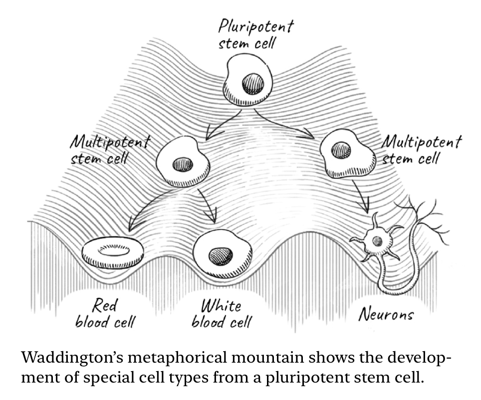

## Senolytics: Increasing b

Senolytics are drugs which specifically remove senescent cells.

Companies: 

1. Unity Biotechnology: Backing by Peter Thiel and Yuri Milner
2. Calico Labs (2013): Backing by Google
3. Altos Labs (2021): Backing by Jeff Bezos
4. Hevolution Fund: Saudi Arabia, $1B/yr

Currently ~$10B/yr spending on longevity research

## Elephant of Heath:

4 legs:

- Nutrition
- Exercise
- Sleep
- Emotional Wellbeing
    
    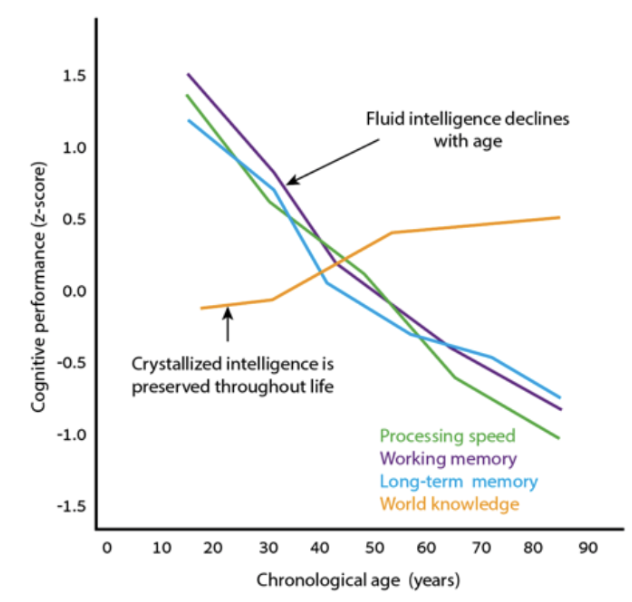
    

## 4 Horsemen of age related diseases:

- **Cancer**
- **Diabetes**
- **Cardiovascular disease**
- **Neurodegenerative disease:** Alzheimer’s disease, Parkinson’s disease

There’s also failure and fibrosis of certain organs like kidney, lung and liver

Other diseases: hearing loss, osteoporosis, cataract, etc

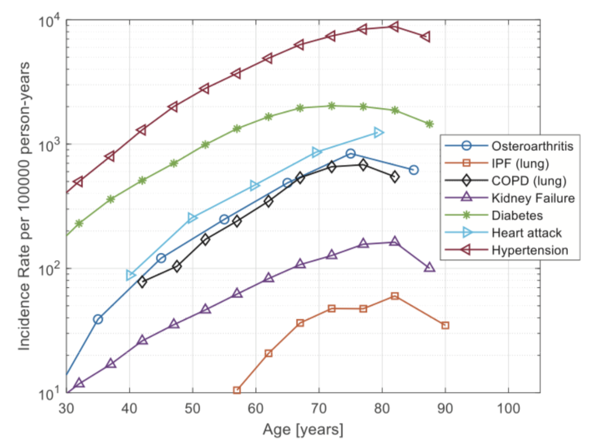

## Cancer

Cancer risk rises by 4000% between age 25 and 65. If the cancer cells manage to grow beyond a critical number of roughly 10^6 cells, they organize a local microenvironment that can prevent further immune clearance.

A classic explanation for the age-dependence of cancer is called the **multiple-hit hypothesis**: the need for several mutations in the same cell to turn it into a cancer cell. Most cancers require a series of mutations, called oncogenic mutations, in order to knock-out pathways that prevent the cell from growing out of control. Such a multiple-hit process has a likelihood that rises roughly as the age to the power of the number of mutations. Cancer in the young often occurs because one of the mutations is already present in the germline and thus in all cells of the body.

Multiple-hit hypothesis cannot explain:

1. Why cancer incidence drops at very old age?
2. Why cancers which require a single mutation, such as some leukemias, also have an exponentially rising incidence with age? Even colon cancer, the poster child for a multiple-mutation progression, has exponentially rising incidence with age rather than a power law.
3. There are many cells with a full set of cancer driver mutations in healthy tissues that do not progress to cancer. For example sampling of colon crypts showed that  about 1% of crypt cells in healthy mid aged individuals have cancer mutations but they very rarely develop into colon cancer. Strikingly about 30% of skin cells have driver mutations for basal cell carcinoma.

Think of many cancers as an AND-gate between chronic inflammation and oncogenic mutations.

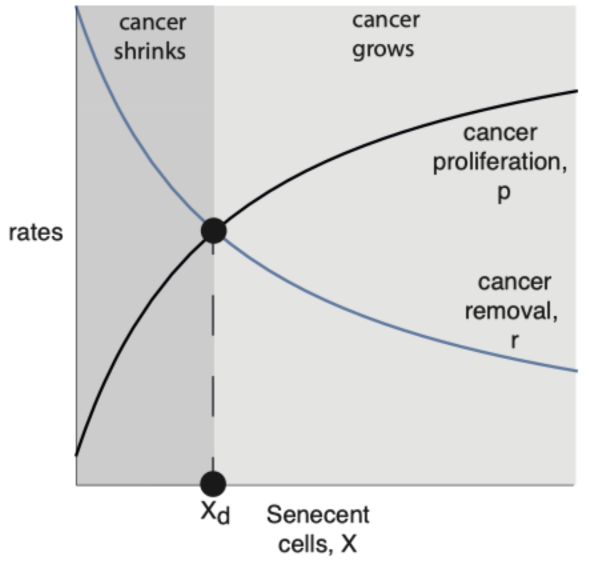

## Alzheimer’s Disease

GWAS study results:

1. Main gene involved is APOE. The APOE protein is the main lipid transporter in the brain. It comes in 3 variants: APOE 2, 3 an 4. 
- APOE2 is protective for Alzheimer.
- APOE3 is risk neutral for Alzheimer. 70% of population
- APOE4 is a major risk factor for Alzheimer.

Since we get one copy from each of our parent, there are 6 possible combination: APOE 3/3 is most common. APOE 4/4 is the worst. Risk factor increases by 10 times. Variants like APOE 3/3 is sometimes labeled as $\epsilon 3/\epsilon 3$. $\epsilon 4/\epsilon 4$ in NOT deterministic for Alzheimer but risk is very high. 

1. Second most important gene is TREM2. It makes receptor for glial cell (immune cell of brain). It works with APOE to clear amyloid beta plaques. APOE4 + TREM2 binds to plaques weakly and hence its not able to clear plaques.

## Sleep

Sleep pressure: Adenosine. Accumulates during wakefulness and degrades during sleep. Caffeine blocks adenosine receptor. “Pressure may scream, but the brain doesn’t listen”

Wake pressure: Cortisol + stimulants+ circadian rhythm

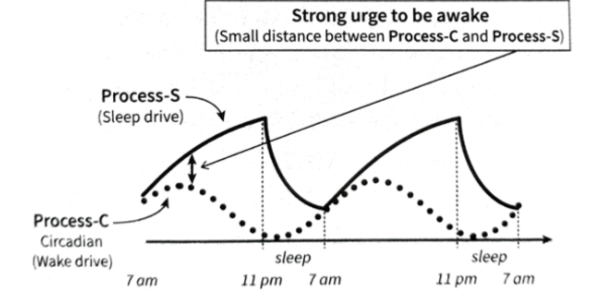

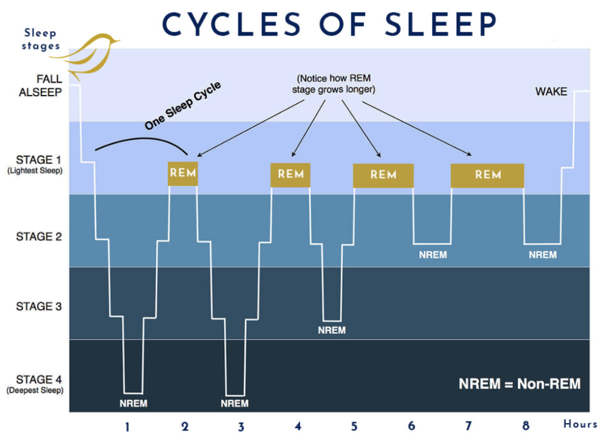
