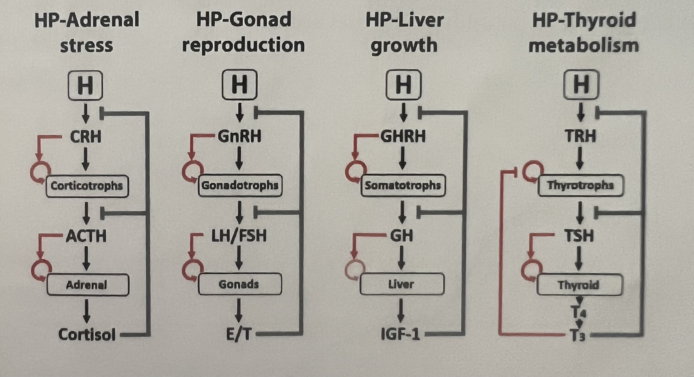
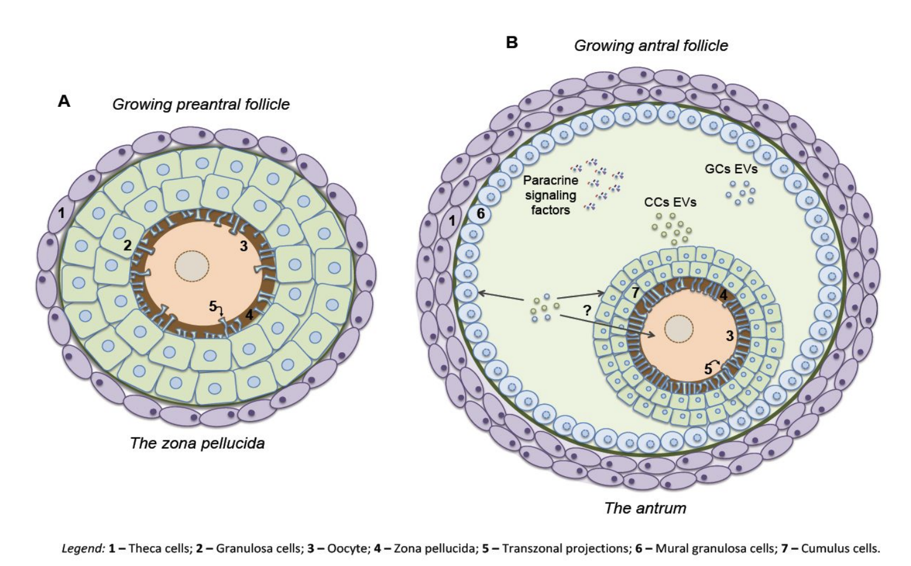
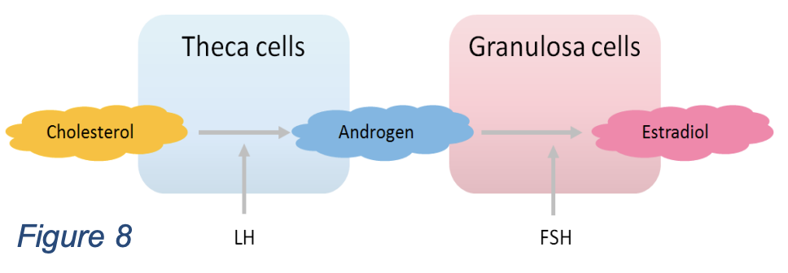
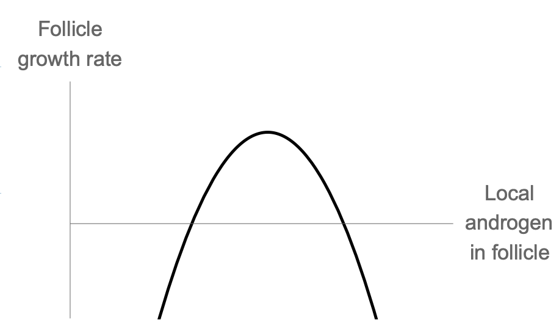
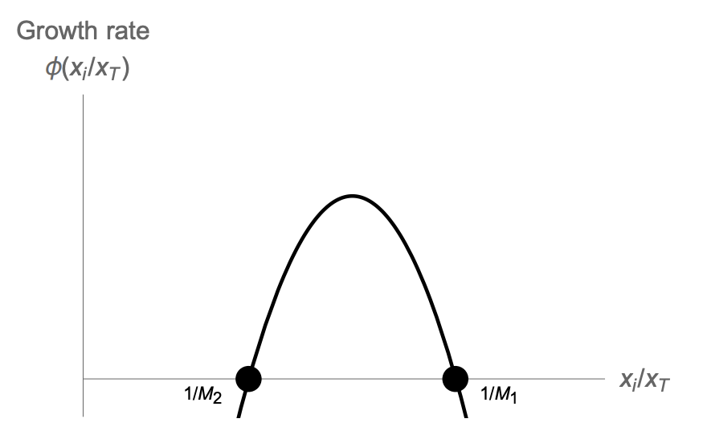
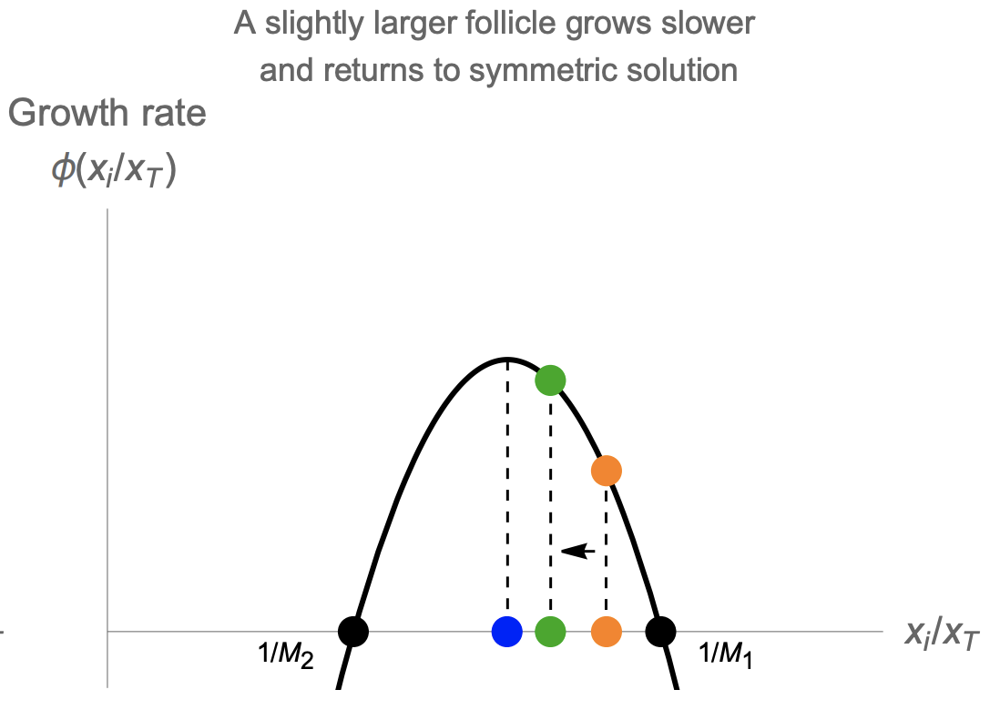
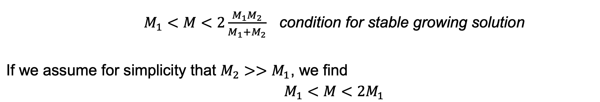
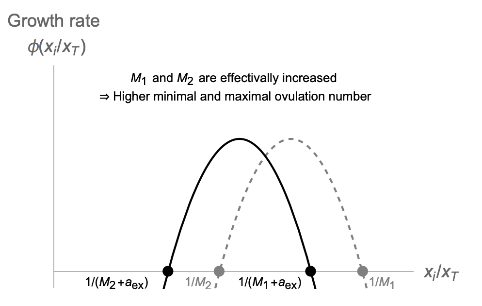
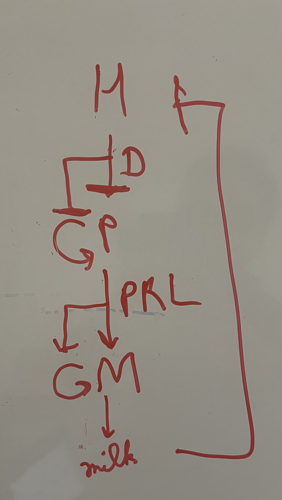

# HPA, HPL, HPT, HPG, HPM axis

## HPA axis

u: stress

$$
\begin{equation}\frac{dx_1}{dt}=q_1\frac{u}{x_3}-\alpha_1 x_1 \end{equation}
$$

$$
\begin{equation}\frac{dx_2}{dt}=q_2\frac{Px_1}{x_3}-\alpha_2 x_2 \end{equation}
$$

$$
\begin{equation}\frac{dx_3}{dt}=q_3Ax_2-\alpha_3 x_3 \end{equation}
$$

$$
\begin{equation}\frac{dP}{dt}=P(b_px_1-a_p) \end{equation}
$$

$$
\begin{equation}\frac{dA}{dt}=A(b_Ax_2-a_A) \end{equation}
$$

This circuit is used for analysis of depression, addiction, PTSD.

Cortisol is sensed by two receptors:

1. Mineralocorticoid receptor (MR): MR, active at the level of the hypothalamus, has high affinity and is nearly saturated at baseline levels.
2. Glucocorticoid receptor (GR): GR is activated at high cortisol levels 

Cortisol inhibits the production of CRH and ACTH by activating both mineralocorticoid (MR) and glucocorticoid (GR) receptors

$$
\begin{equation}\frac{dx_1}{dt}=q_1MR(x_3)GR(x_3)u-\alpha_1 x_1=q_1\frac{u}{x_3}-\alpha_1 x_1 \end{equation}
$$

$$
\begin{equation}\frac{dx_2}{dt}=q_2GR(x_3)Px_1-\alpha_2 x_2 \end{equation}
$$

$$
MR(x_3)=\frac{1}{x_3},\;\;\;\;\;\;GR(x_3)=\frac{1}{1+(\frac{x_3}{K_{GR}})^n}
$$

$$
\frac{dx_4}{dt}=w_4(\frac{P}{x_3}x_1-x_4)
$$

## HPL axis

u: increases upon starvation and during sleep

The growth hormones are highest during sleep whereas cortisol, the hormone for activity, is highest during the day- allowing a division of labor between day time activity and nighttime growth and maintenance.

$$
\begin{equation}\frac{dx_1}{dt}=q_1\frac{Hu}{x_3}-\alpha_1 x_1 \end{equation}
$$

$$
\begin{equation}\frac{dx_2}{dt}=q_2\frac{Px_1}{x_3}-\alpha_2 x_2 \end{equation}
$$

$$
\begin{equation}\frac{dx_3}{dt}=q_3Lx_2^n-\alpha_3 x_3 \end{equation}
$$

$$
\begin{equation}\frac{dP}{dt}=P(b_px_1-a_p) \end{equation}
$$

$$
\begin{equation}\frac{dL}{dt}=L(b_Lx_2-a_L) \end{equation}
$$

Height velocity:

$$
\frac{dh}{dt}=w_2x_2+w_3x_3
$$

Values of parameters for simulating the differential equations:

- $q_1=1/5 \;\text{min}^{-1}$
- $q_2=1/30 \;\text{min}^{-1}$
- $q_3=1/90 \;\text{min}^{-1}$
- $\alpha_1=1/6 \;\text{min}^{-1}$
- $\alpha_2=1/30 \;\text{min}^{-1}$
- $\alpha_3=1/110 \;\text{min}^{-1}$
- $b_P=1/60 \;\text{day}^{-1}$
- $b_L=1/60 \;\text{day}^{-1}$
- $a_P=1/60 \; \text{day}^{-1}$
- $a_L=1/5 \; \text{day}^{-1}$
- n = 1/3

The weights $w_2$ and $w_3$ depend on may factors in the bone cell, and indeed height depends
on nearly 1000 genes of small effect which add up height is about 80% heritable.

## HPT axis

Free $T_4$ levels remains nearly constant in the body. (10-20 pmol/L)

$$
\begin{equation}\frac{dx_1}{dt}=q_1\frac{H}{x_3}-\alpha_1 x_1 \end{equation}
$$

$$
\begin{equation}\frac{dx_2}{dt}=q_2\frac{Px_1}{x_3}-\alpha_2 x_2 \end{equation}
$$

$$
\begin{equation}\frac{dx_3}{dt}=q_3Tx_2-\alpha_3 x_3 \end{equation}
$$

$$
\begin{equation}\frac{dP}{dt}=P(\frac{b_p}{x_3}-a_p) \end{equation}
$$

$$
\begin{equation}\frac{dT}{dt}=T(b_Tx_2-a_T) \end{equation}
$$

Hypothyroidism:  Most common cause is Hashimoto’s disease. Affects 2% of the population, primarily women. T-cells attack and kill thyrocytes. Antigens recognized by T-cells in Hashimoto are TPO and Tg proteins. T cells activate B cells to make antibodies against Tg and TPO proteins.

Hyperthyroidism: A major cause is batch of growing cells in thyroid that form a nodule that secretes too much thyroid hormone T4. They occur in 1% of population, primarily in old age. (secrete and grow circuit analogous to beta cell circuit). Graves’ disease is autoimmune condition in which body produces antibodies that activate TSH receptor, mimicking TSH. It occurs in 1% of the population primarily in middle age.

## HPG axis

$$
\begin{equation}\frac{dx_1}{dt}=q_1\frac{H}{x_3}-\alpha_1 x_1 \end{equation}
$$

$$
\begin{equation}\frac{dx_2}{dt}=q_2\frac{Px_1}{x_3}-\alpha_2 x_2 \end{equation}
$$

$$
\begin{equation}\frac{dx_3}{dt}=q_3Gx_2-\alpha_3 x_3 \end{equation}
$$

$$
\begin{equation}\frac{dP}{dt}=P(b_px_1-a_p) \end{equation}
$$

$$
\begin{equation}\frac{dG}{dt}=G(b_Gx_2-a_G) \end{equation}
$$

Unlike other axis when $x_3$ is very high, the negative feedback on $x_2$ becomes positive feedback. 

This switch causes the LH surge at about day 14 of the menstrual cycle.

The LH surge triggers ovulation- the dominant follicle bursts the ovary in an inflammatory process. It goes down the fallopian tube to the uterus. The remaining G and T cells become a new hormone-secreting gland called the corpus luteum (LH is luteinizing hormone). The corpus
luteum secretes progesterone, setting off the second half of the cycle. If there is no fertilization, the thickened lining of the uterus sloths off causing the bleeding in the first 5 days or so of the next cycle.

Out of many follicles that start a race every menstrual cycle, only one (or M in other species) gets to win and ovulate.

In humans M=1 (fraternal twins are rare ~1/89 unassisted pregnancies). In mice M=6-8. In deer typically M=2.

In each menstrual cycle, a batch of about 10-20 follicles start the race. In women, these follicles are about 2-5mm in size and have about 2 million granulosa cells. They begin to grow under control of FSH. **Granulosa and theca cells** divide. The smaller follicles die, until only one (or only M, in other animals) is left. This dominant follicle is ~20mm large with ~60 million granulosa cells. It is the winning follicle, the one that will ovulate with a chance to meet sperm, fertilize, and make a baby.

The race is regulated by hormones made by the follicles themselves. Follicles are thus also hormone-producing glands. The theca cells produce androgen (A) under the influence of LH. Some of the androgen goes to the circulation, the rest is converted by granulosa cells, under control of FSH, into the important hormone estrogen (E). Estrogen is the $x_3$ in this axis. Estrogen shuts off FSH production (production of $x_1$ and $x_2$), just like the long feedback in the HPA axis.

*Inside the follicle*

Thus, FSH drives the race. Estrogen is made by all participants and causes a reduction in FSH.
This is a self-regulating race. Unlike the HPA axis, where $x_3$ always inhibits $x_2$, when estrogen is very high, its negative effect on $x_2$ becomes a positive effect. Negative feedback turns to positive feedback. This switch causes the LH surge at about day 14 of the menstrual cycle. The LH surge triggers ovulation- the dominant follicle bursts the ovary in an inflammatory process. It goes down the fallopian tube to the uterus. The remaining G and T cells become a new hormone-secreting gland called the corpus luteum (LH is luteinizing hormone). The corpus luteum secretes progesterone, setting off the second half of the cycle. If there is no fertilization, the thickened lining of the uterus sloths off causing the bleeding in the first 5 days or so of the next cycle.

The follicle competition is known to occur through the circulation and not primarily by contacts
within each ovary. Evidence for this is that follicles start the race in both ovaries, but only one
ovary ovulates. Which ovary ovulates appears to be random every cycle. If a female loses one
ovary (ovariectomy), the remaining ovary ovulates every month - doubling its ovulation frequency.

Size of competing follicle, $x_i$ is given by,

$$
\frac{dx_i}{dt}=x_iFSH\sim \frac{x_i}{E}\sim \frac{x_i}{\sum_ix_i} =\frac{x_i}{x_T}
$$

The growth rate depends on the relative size!

When animals follicles in vitro are treated with low levels of androgen, it enhances follicle growth and increased the ovulation number. Thus, androgen has a biphasic effect on follicles. In PCOS, there’s high androgen but no ovulation.

Each follicle makes androgen, the defining factor must be the local androgen
concentration in follicle i, denoted $A_i$. Thus

$$
\frac{dx_i}{dt}=\frac{x_i}{x_T}\phi(A_i)=\frac{x_i}{x_T}\phi(\frac{x_i}{x_T})
$$

This is a symmetric solution, in which the relative size of the M growing follicles is xi/xT = 1/M. The other, losing, follicles have xi/xT = 0.

We find that the growing follicles have a constant velocity

$$
x_i=vt \; \; \text{where} \; \;v=\frac{1}{M}\phi(\frac{1}{M})
$$

For the human case M=1, M1 needs to be between zero and one. This model can also explain how high levels of circulating androgen might interfere with ovulation, as in PCOS. High levels of androgen are effectively like shifting the biphasic curve to the left (Anew = Aold + c). This reduces 1/M1, or equivalently increases M1. When M1 becomes larger than the initial number of follicles entering the race, about 10-20, there are no solutions, and no ovulations can occur.

Normalizing insulin resistance may important for PCOS, because many patients with PCOS
have insulin resistance leading to high insulin levels that induces androgen production in follicles (theca cells have insulin receptors).

**HPM axis**

M: Mammary glands (B: Breast aciner cells)

D: Dopamine

PRL: prolactin

