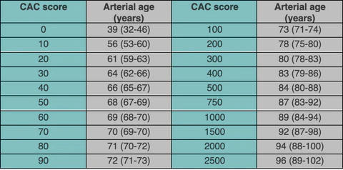
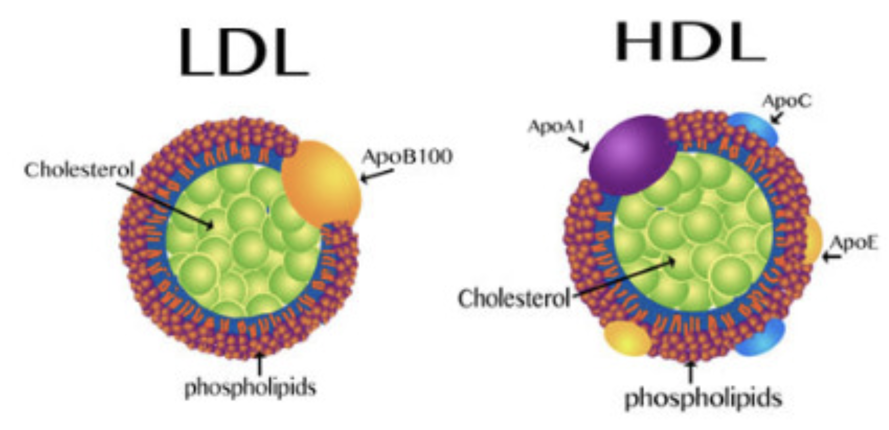
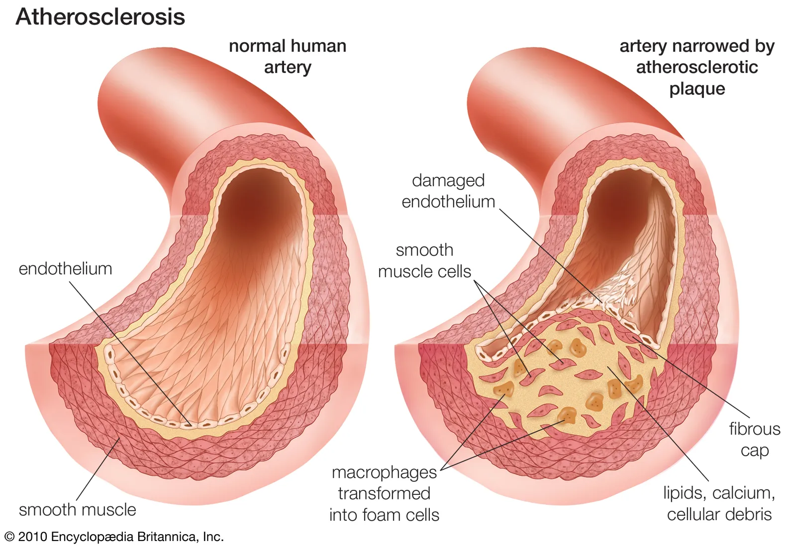
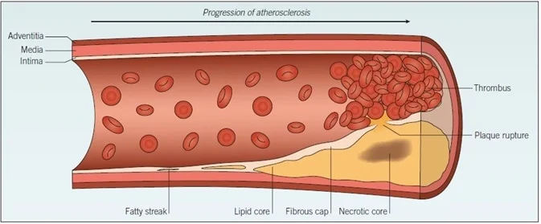
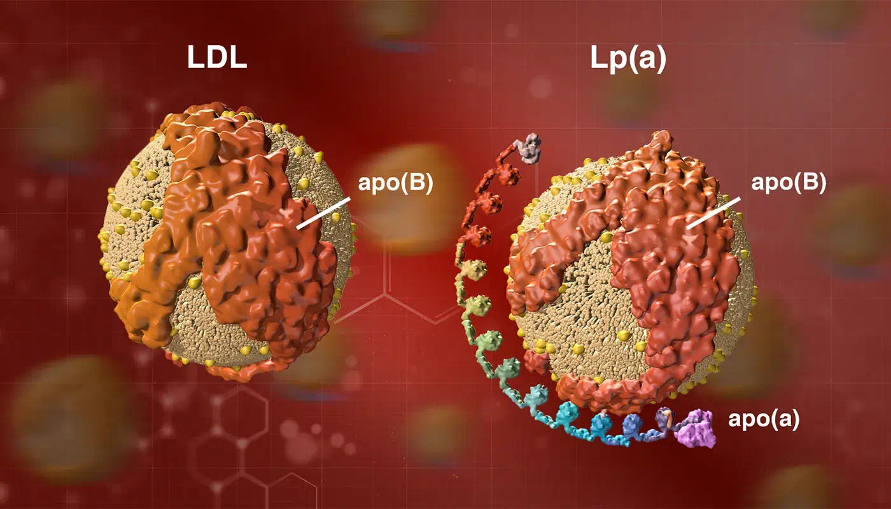
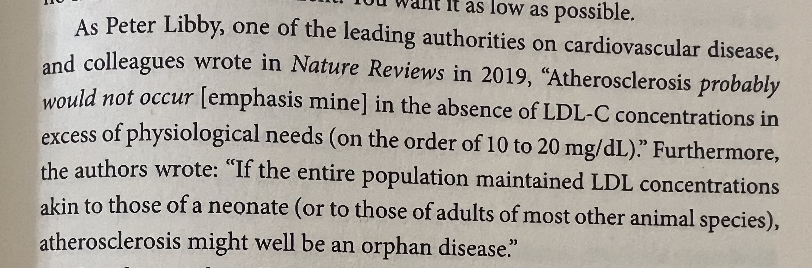

# Chapter 7: Heart Disease

**ASCVD**: Heart disease + stroke. Atherosclerotic cardiovascular disease

ASCVD is the leading cause of death. 2300 people die every day in US.

American women are 10 times more likely to die from ASCVD than breast cancer. (1 in 3 versus 1 in 30).

CT of heart to detect calcification in coronary arteries. Output: calcium scores

ASCVD should be “the tenth leading cause of death, not the first”

---

---

Lipoproteins are cargo that transports lipids (insoluble in water) throughout the body. Lipids are inside, proteins cover it.

Cholesterol belongs to lipid family. Liver is the main cholesterol supplier for the body. 20% supply of total cholesterol in the body.

LDL carry more lipids than HDL. HDL contains more proteins.

HDL is wrapped around apolipoprotein A (apoA).

LDL is wrapped around apolipoprotein B (apoB).

“Cholesterol in the diet doesn’t matter at all”- Ancel Keys, nutrition scientist.

“Cholesterol is not a nutrient of concern for overconsumption”

---

---

What proportion of people have major ASCVD episode before 65? Answer : 1/2 in men and 1/3 in women. In men 1/4 occur before 54.

Analogy for an artery

| Street  | Lumen |
| --- | --- |
| Fence | Endothelium  |
| Houses | Arterial wall |
| Front porch | subendothelial space |

HDL can pass the endothelial barrier easily in both directions, LDL are far more likely to getting stuck inside. LDL then get oxidized when they come in contact with ROS. Oxidized LDL, attracts other LDL/apoB. It is not really LDL but apoB that is the problem. For example, VLDL and IDL are other carriers of apoB. 

Measure apoB particles in bloodstream to get sense of damage being caused to vascular system.

Smoking damages endothelium chemically, high blood pressure damages it mechanically.

Oxidized LDL/apoB attracts immune cells like monocyte which get converted to macrophages. These macrophages eat cholesterol and blow up into foam cells. When enough foam cells gather, they form a “fatty streak”. It is precursor to development of atherosclerotic plaque.

**Delipidation**: HDL particles can suck cholesterol out of foam cells and return them to liver for reuse. 

HDL is highly mysterious. Inject someone with HDL, doesn’t reduce cardiovascular risk at all. Someone with high LDL-C and apoB can have normal CT angiogram, calcium score. We don’t know why. Understanding HDL is key to resolving this mystery.

Mendelian Randomization studies:

Does low HDL-C causally increase the risk of myocardial infarction? No

Does raising HDL-C causally decrease the risk of myocardial infarction? No

Calcification is a way of stabilizing the plaque to protect the arteries. Like pouring concrete on Chernobyl reactor. Noncalcified plaques are more dangerous than calcified plaques. 

---

---

Lp(a)= LDL + apo(a). Not to be confused with apoA. Lp(a) may act as a cleansing agent, but because Lp(a) contains apoB, it can also get lodged in subendothelial space. Even worse it can act as a thrombotic or proclotting factor which speeds up formation of arterial plaque.

Everyone should get Lp(a) test. Its level is genetic so it needs to be tested just once in lifetime.

In blood panel always look for: apoB and Lp(a) levels.

“apoB particles - LDL, VLDL, Lp(a) - are causally linked to ASCVD.”