# Transcription Regulatory Networks

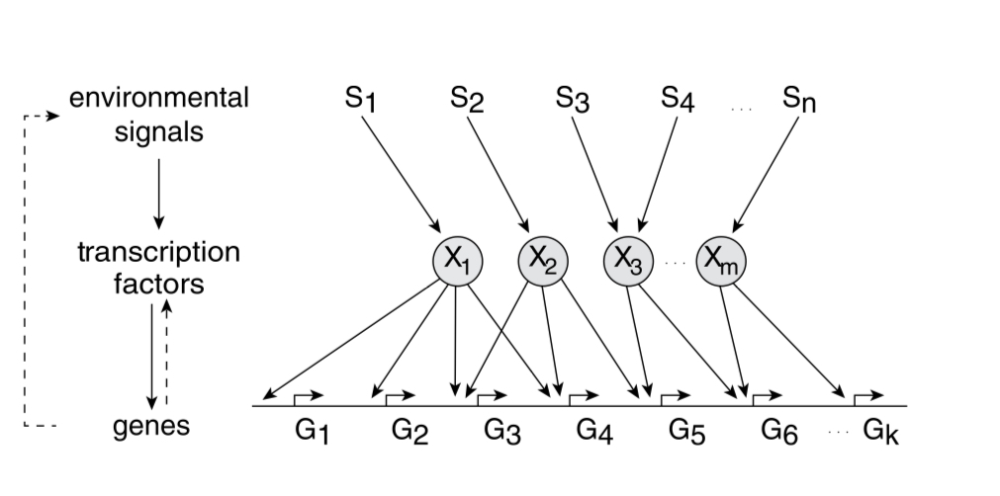

*E. coli* has 300 degrees of freedom (transcription factors) to model the environment and regulate the production of 4500 proteins.

**Promoter:** It is sequence of base pairs that precedes the genes and determines the rate of gene expression. RNAp (RNA polymerase) binds to this site.

Transcription factors can bind to the promotor to increase the transcription rate of the gene (acting as activators) or reduce the transcription rate (acting as repressors). 

In *E. coli* 60% of TF are activators and 40% are repressors. 

Each transcription factor acts primarily in one mode for its target genes: either as an activator or a repressor

 

| **Neural Network** | **Transcription network**  |
| --- | --- |
| Neurons: 80% Excitatory, 20% Inhibitory | TF: 60% Activators, 40% Repressors  |
| Dales law: Each neuron is either excitatory or inhibitory | Each TF is either activator or repressor for its target genes |
| Number of neurons: 302 | Number of TFs: 300 |

Let X be the concentration of transcription factor and Y be the rate of production of protein controlled by X. Then, Y=f(X) where f is Hill function. 

When acting as activator:

$$
f(X)=\beta\frac{X^n}{K^n+X^n}
$$

When acting as repressor:

$$
f(X)=\beta\frac{K^n}{K^n+X^n}
$$

Here, $\beta$ is the maximal promotor activity, K is the activation coefficient which is about the concentration needed to significantly start producing protein X and n = 1-4.

A logic approximation can be made using step function $\theta$:

For activator:

$$
f(X)=\beta \theta(X>K)
$$

For repressor:

$$
f(X)=\beta \theta(X<K)
$$

Examples:

AND gate: A gene requiring 2 activator proteins (TF) to bind simultaneously:

$$
f(X)=\beta \theta(X>K)\theta(Y>K) =X \; \mathrm{and} \;Y
$$

SUM gate:

$$
f(X, Y)=\beta_X X+\beta_Y Y
$$

## Network motifs in sensory networks

**Simple regulation:** Dynamics of protein production (X):

$$
\frac{dX}{dt}=\beta-\alpha X
$$

Here, $\beta$ is production rate and $\alpha$ is removal rate.

**Negative Autoregulation (NAR):** Negative autoregulation (NAR) occurs when a transcription factor represses the transcription of its own gene. This network motif occurs in about half of the repressors in *E. coli* and in many eukaryotic repressors. 

NAR has 2 functions:

- It speeds up protein production.
- It reduces cell–cell variation in protein levels.

$$
\frac{dX}{dt}=f(X)-\alpha X
$$

where f(.) is the repressor function.

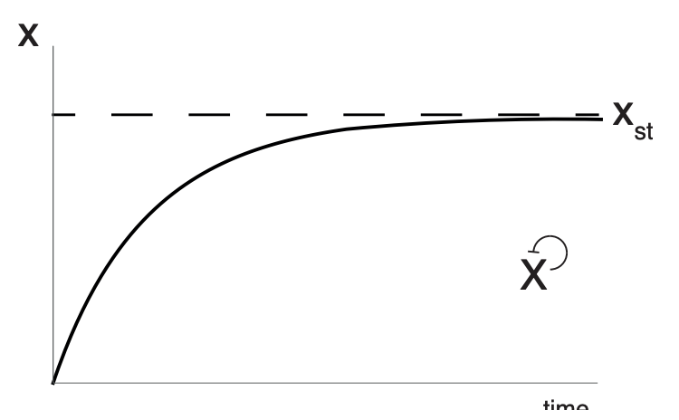

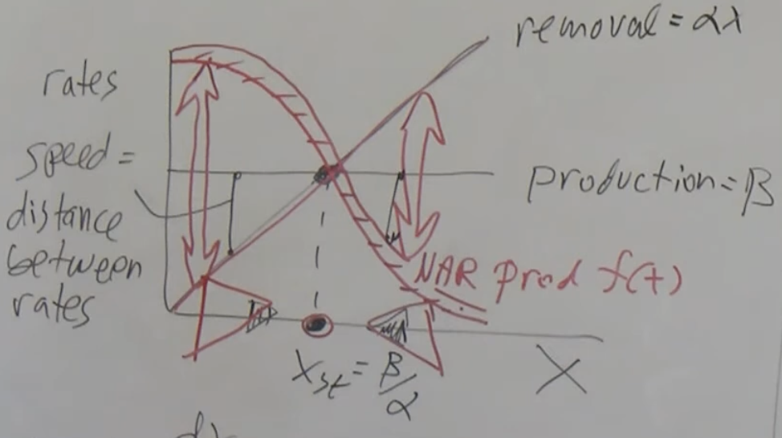

**Positive autoregulation:** Positive autoregulation (PAR) occurs when a transcription factor enhances its own rate of production. The effects are opposite to those of NAR: response times are slowed and variations usually enhanced.

**Feedforward loops**: Two types: coherent and incoherent. Coherent FFL have the same effect (activating or repressing) on both branches while Incoherent FFL have opposite effect on the two branches.

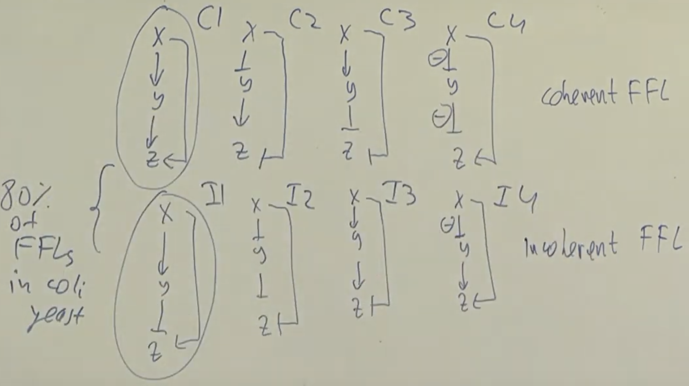

Coherent type 1 (C1) and incoherent type 1 (I1) are most common.

**C1-FFL:** The C1-FFL is a ‘sign-sensitive delay’ element and a persistence detector.

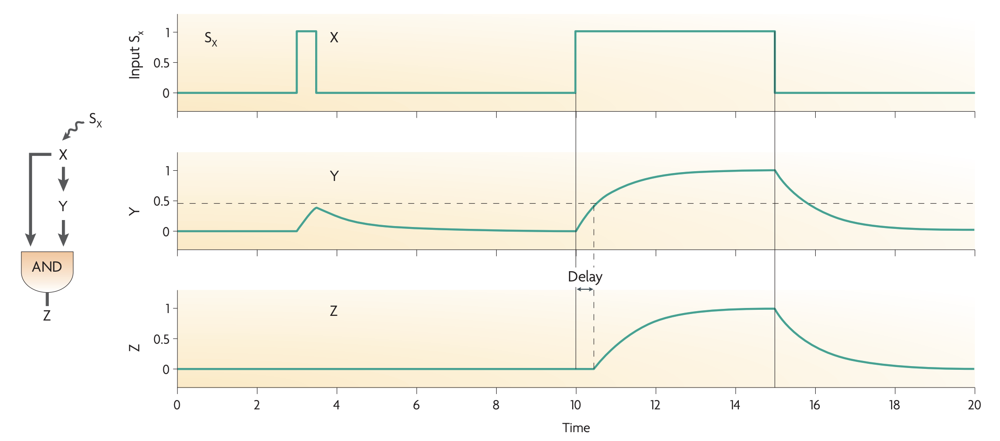

C1 FFL can work as a AND gate or OR gate. AND gate example (Arabinose system)

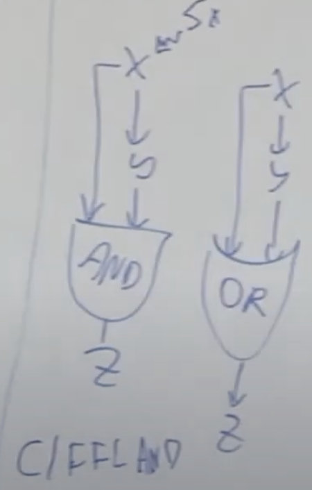

## **I1-FFL**

The I1-FFL is a pulse generator and response accelerator

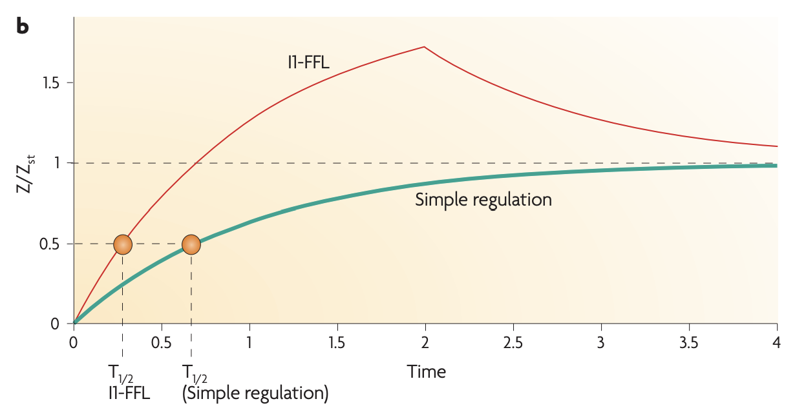

**Application**: Fold Change detection ****

Fold change detection is a phenomenon in which a system's repsonse to an input
depends on its relative change against a background, rather than the absolute magnitude of that input. it is widely observed biological phenomena.  For instance, E. coli move toward an attractive chemical stimulus by sensing the relative change of its concentration against the background. Similarly, the smallest change in brightness that the human visual system can
detect increases with the ambient light level, a result known as the Weber-Fechner
law. 

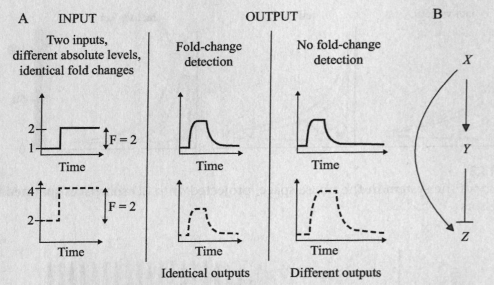

Equation for the system:

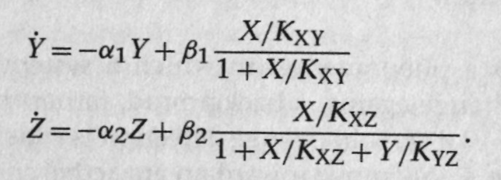

Assume X binds weakly and Y binds strongly to their respective binding sites. Nondimensionalize the equations to get:

$$
\frac{dy}{dt}=-y+x\\ r\frac{dz}{dt}=-z+\frac{x}{y}\\
$$

where $r=\alpha_1/\alpha_2$, which is a ratio of the half-lives of Y and Z. Also, $x=X/X_0$.

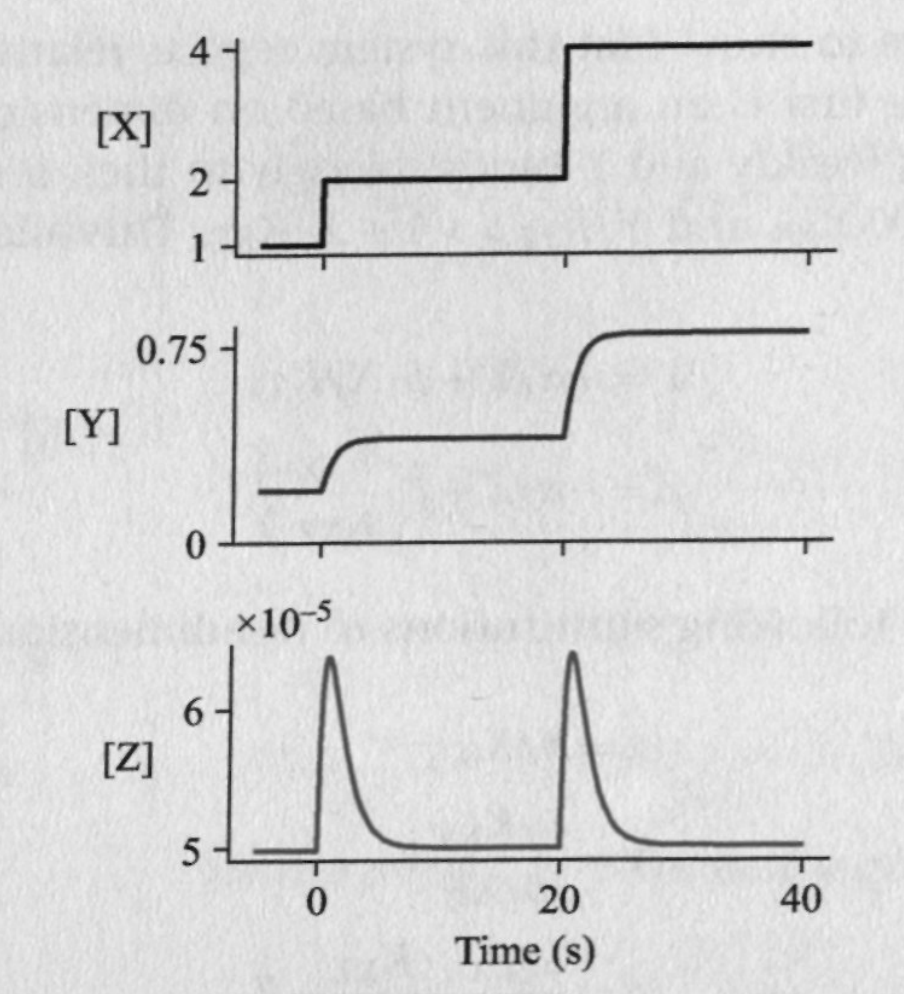

## 4 node motifs:

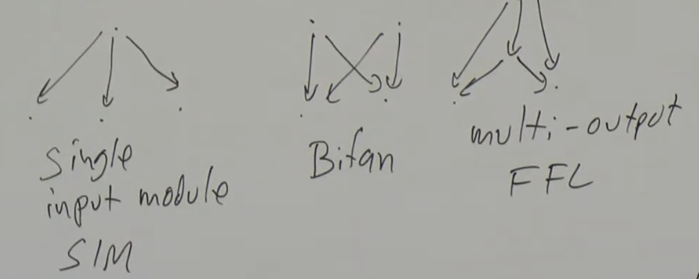

**Multi-output FFLs**

**Single input module (SIM):** SIM can generate temporal order

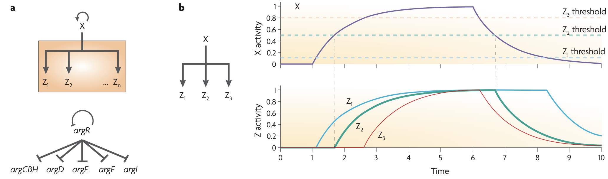

**Dense overlapping regulons (DOR) or multi-input motifs (MIMs):**

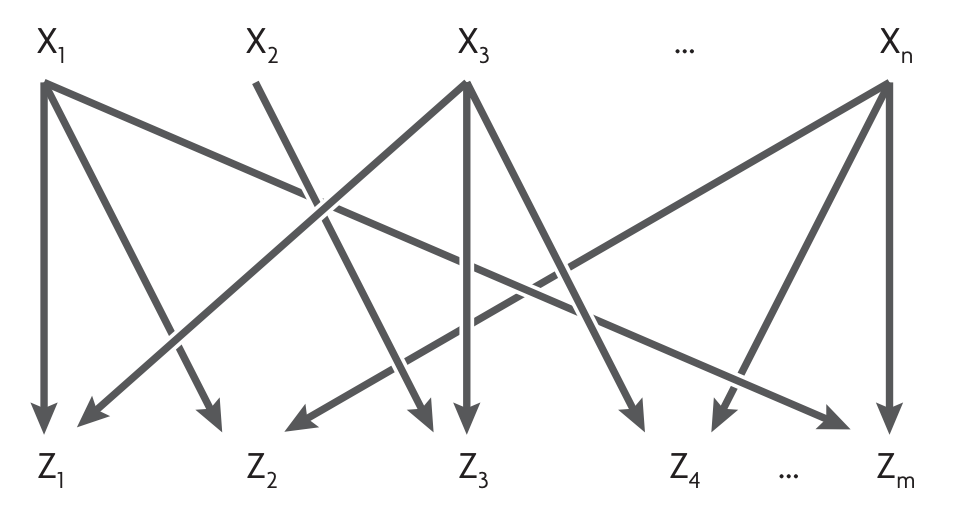

## Network motifs in developmental networks

Developmental transcription networks use all the network motifs described above. In addition, as a result of their specific requirements, developmental networks use several other network motifs that are not commonly found in sensory networks.

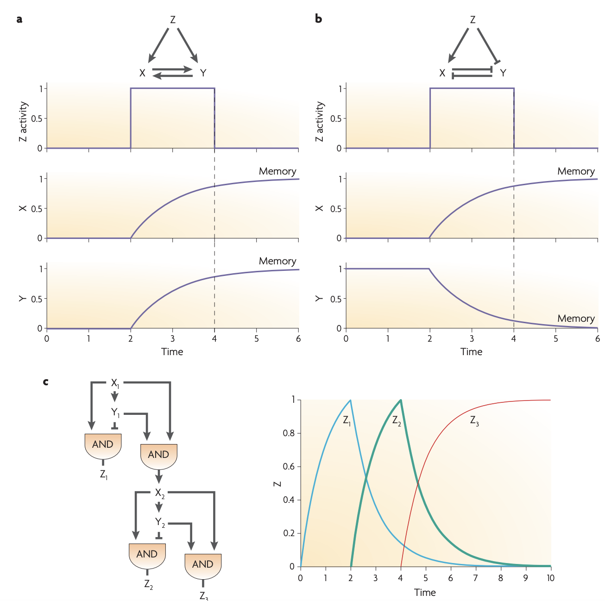

## Repressilator

It is an artificial genetic circuit made of three repressors: *lacI, tetR,* and *$\lambda$ cl*.

Three repressors regulate each other in a cycle: X represses Y, Y represses Z and Z represses X. Z also represses a green-fluorescent protein (GFP) gene which is a readout of the circuit.

**Convention**: Italicize the name when referring to the gene / mRNA and capitalize it when referring to the gene product / protein.

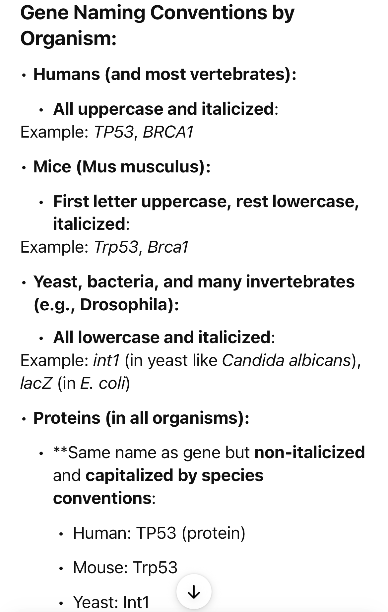