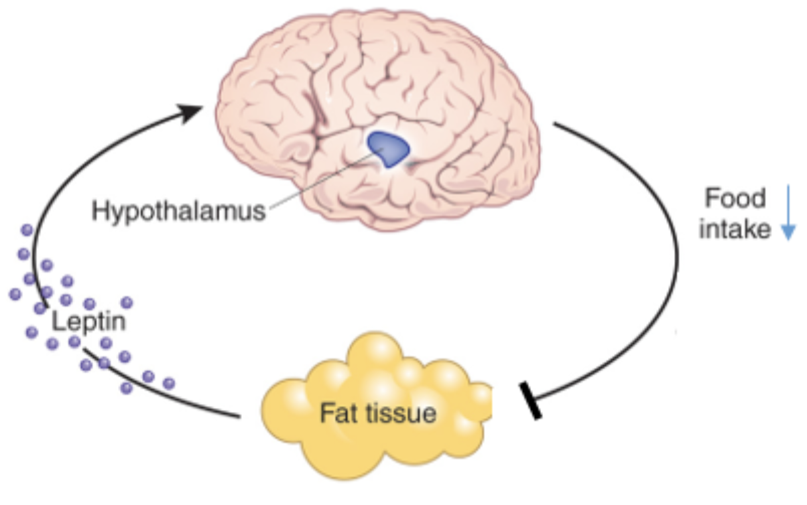
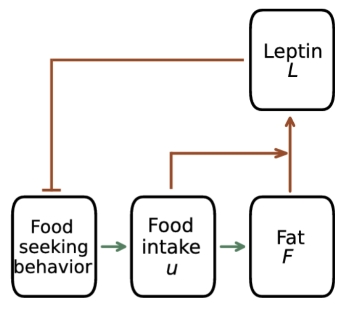
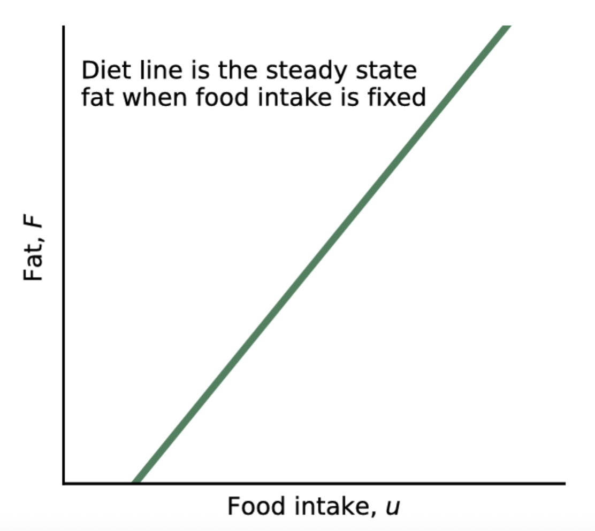
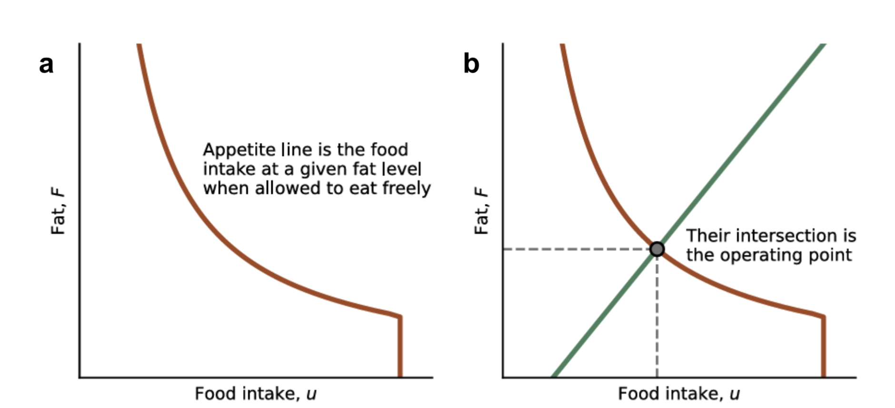
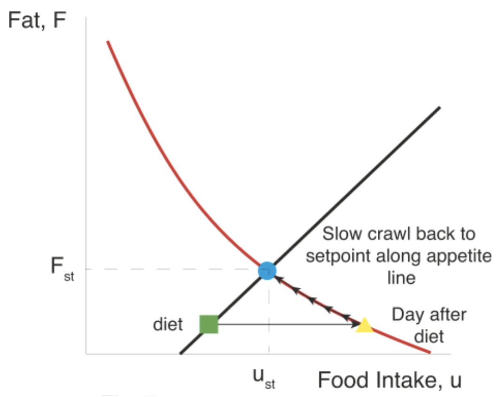
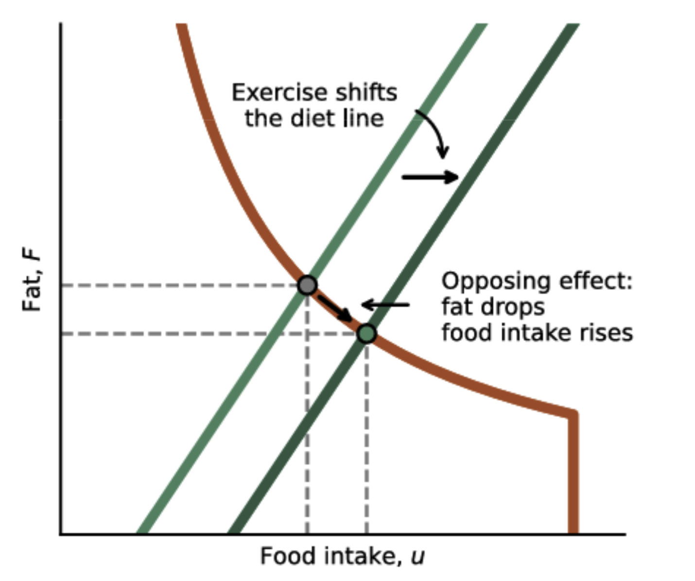
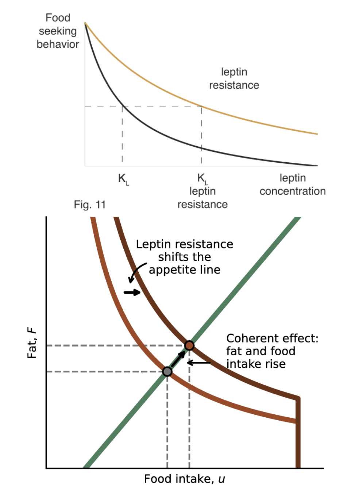
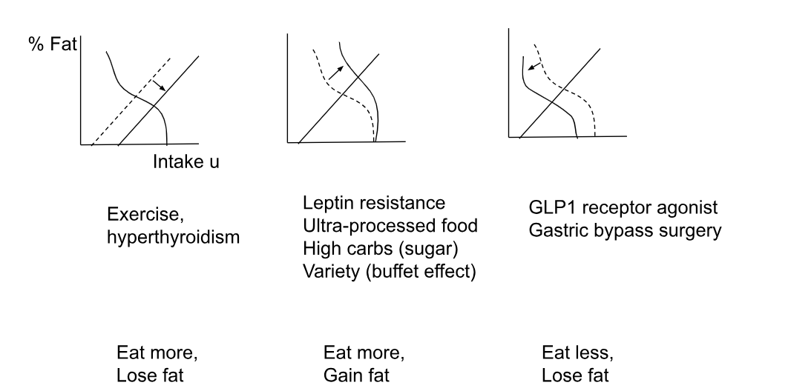

# Weight Set-Point

How weight stays so nearly constant over decades?

For a setpoint, we need to **exactly** balance our energy intake and energy expenditure, which is remarkable given that we eat about a million calories per year. 

Fat cells used to be considered as simple containers for fatty acids, a storage depot that can deploy fatty acids for use as fuel for the body in times of need. The discovery of leptin promoted fat to the status of an endocrine organ- a smart organ capable of communicating with the brain. We now know that there are many other such adipokine hormones talking with other organs. 

## Dynamics of Dieting

## Physical exercise shifts the diet line

## Obesity shifts the appetite line caused by leptin resistance

Appetite line shifts when leptin works less effectively, a phenomenon called leptin resistance. The cause of leptin resistance is unknown.

